## Exercise 5: Power BI reports with Direct Lake

So, we saw that Contoso was able to have all their organizational data in OneLake in Microsoft Fabric while still continuing to invest in Azure Databricks from their past architecture. You may be asking, what are the benefits? The benefit’s are tremendous! Contoso can leverage the persona-based experiences in Microsoft Fabric for their various personas. They can choose their type of workloads and computes to run on top of this data and they could easily scale to add even more sources of data in the future. On top of that, they could benefit from the governance features of Microsoft Purview and OneSecurity across their entire data estate.They could leverage Power BI for compelling visualizations including near real-time data for making data driven decisions. Besides, with the new Direct Lake query mode in Power BI, they no longer had to choose between data latency or performance; they could get both! Now as Business Analyst let's see how we can leverage the Power BI experience in Microsoft Fabric!

### Task 5.1: Leverage Power BI to derive actionable insights from data in Lakehouse using Direct Lake mode.

In this task, you will work with Power BI to reveal some valuable insights.

1. Open a new web session (tab) in the JumpVM, and paste the below link.

```BASH
https://app.powerbi.com
```

`Note: If you are working in the same tab you were working before, please close the tabs like warehouse, lakehouse, pipeline etc. Opened in the left task bar of the Microsoft Fabric to avoid the notification when you are opening more than 10 tabs.`

`Note: Dismiss any popups that appear on your screen.`

2. In Power BI service, click on **Workspaces** and click on **contosoSales**. 

	

3. Click on **Upload** and select **Browse**.

	

4. Navigate to the reports in your JumpVM through the path **"C:\LabFiles\IgniteDreamLab2023\artifacts\reports"**, select the **Campaign Analytics Report with Lakehouse.pbix** report and click on the **Open** button.

	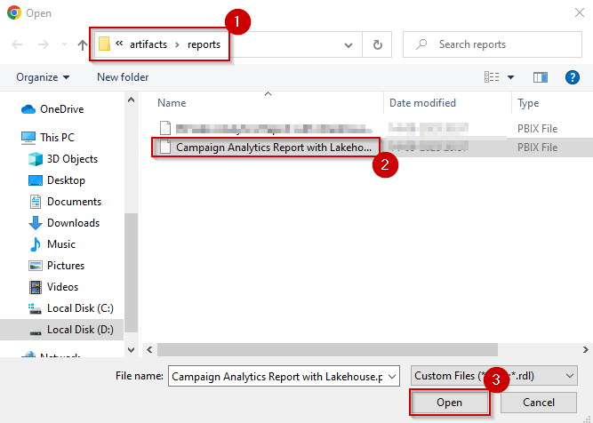

`Note: Wait for the report to upload.`

5. **Open** the report by clicking on it.

	

`Note: Make sure to click on the REPORT and not the Dataset or Dashboard which is auto created with the same name, and close if you see any popups.`

   

6. This report has three sections:
 - Churn Analysis
 - Campaign Analytics
 - Website Analytics

	

7. Navigate to the **Churn Analysis Tab**, to analyze Customer Churn. This report, along with the Campaign Analytics and Website Analytics reports in Power BI, are coming from the data Lakehouse that we created in earlier exercises.

	

In the **Scatter Chart** on the left, the blue dots represent customers that are more likely to churn, and the peach dots represent customers that are less likely to churn. Notice that when customer tenure is low and their spend amount is low, the customers are more likely to churn.

   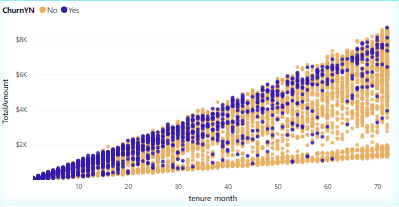

With this insight, Contoso decides to target customers with lesser tenure and lesser spend amounts through their new campaigns.

Now, let's go Campaign Analytics.

8. Select the **Campaign Analytics** tab from the top right pane to navigate to the Campaign Analytics report.

	

In this Campaign Analytics report, the bar chart shows that the most popular campaigns Contoso launched were gogreen and sustainablefashion.

   

Now, let's go Website Analytics. 

9. Select **Website Analytics** from the top right pane to navigate to the Website Analytics Report.

   

Here we see an immediate problem for Contoso. The bounce rate is high. It looks like a large population of their customers/visitors leave their website without much activity. The Power BI report reveals to Contoso that in fact a large population of the unhappy customers who contribute to the high bounce rate on their website are Millennials. In addition, it specifically helps Contoso identify the reason why these millennials are unhappy. It is evident that when they use their mobile devices to search for their favorite products such as beach accessories, their product searches are failing!

   

As a result of this analysis, Contoso reduced their bounce rate by implementing a mobile-friendly website with fast product searches, focusing on high demand products for millennials. These changes not only improve the bounce rate dramatically, but they also reward Contoso with unprecedented sales at their sales event.

**OPTIONAL Exercise**

## Exercise 6: Real-time Analytics experience, explore Streaming data using KQL DB for a near real-time analytics scenario

In a short span of few months the CDO and his team implemented transformations using Microsoft Fabric and Azure Databricks.

Imagine it is 6 am on the day of the black Friday sale during Thanksgiving week for Contoso. Customers are entering stores in large numbers. Specifically, we will see how near real-time data is used to make decisions for the next moment at Contoso's stores to ensure optimal temperatures are maintained for their customers while they shop!

### Task 6.1: Create a KQL Database

1. In **Power BI** service, click on **Workspaces** and click on **contosoSales**. 

	

2. Click on **+ New** and then click on **Show all**.

`Note: You may see More options instead of Show all.`

 

3. In the new window, scroll down to the **Real-Time Analytics** section and click on **KQL Database (Preview)** and wait for some time popup to appear.

	

4. Enter the name of `KQL Database Name` as **Contoso-KQL-DB**, click on the **Create** button and wait for the database to be created.

```BASH
Contoso-KQL-DB
```

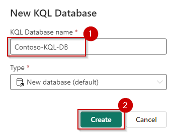

### Task 6.2: Ingest real-time/historical data into KQL DB

1. Once the database is created, click on **Get data** drop down and then click on **Event Hubs**.

    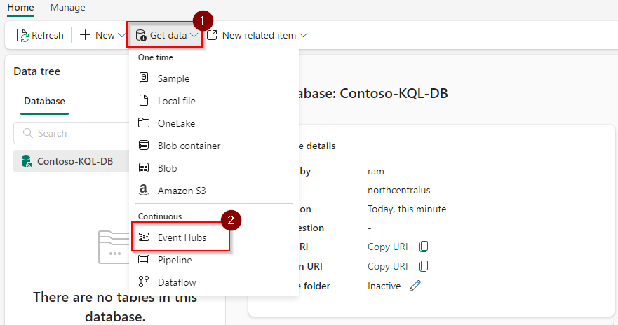

2. In the Destination tab, select the **New table**, paste the Table **thermostat** and then click on the **Next: Source** button.

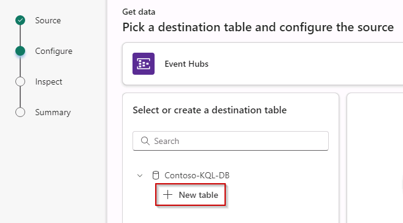


```BASH
thermostat
```


3. In the Configure data source tab, select the **Create new connection** radio button. Fill the **Event Hub namespace** and **Event Hub** fields with below given values.

```BASH	
 <inject key="eventhubNamespace" enableCopy="true"/>
```

```BASH
thermostat
```

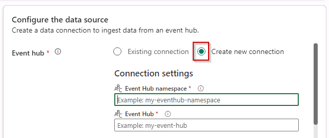

`Note: For the rest of the fields we need to move to the Azure Portal and fetch the required values.`

4. Navigate to the **Azure Portal**, search for **fabric-dpoc** in the search tab and select the resource group name starting with **fabric-dpoc**.

    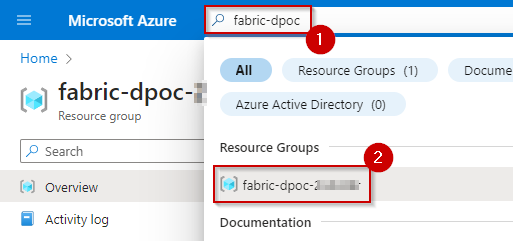

5. Search for **Event Hubs Namespace** in the resource group window and click on the **Event Hubs Namespace resource**.

    


7. Scroll down in the left navigation pane and click on **Event Hubs** under the **Entities** section. 

	

8. Click on the **thermostat** event hub.

	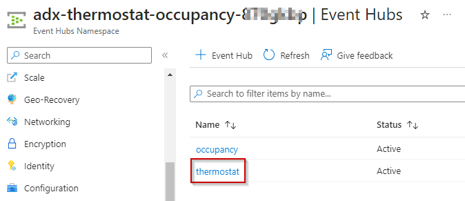

9. Click on **Shared access policies** in the left pane under **Settings**, then click on **thermostat** and finally copy the **primary key** and paste it in a notepad for further use. 

   

10. Go back to the **Power BI tab**.


   

11. Scroll down and select **Shared Access Key** for Authentication kind, enter **thermostat** as the Shared Access Key Name and then paste the value copied in **step 9** in the **Shared Access Key** field and click on the **Save** button.


```BASH
thermostat
```

   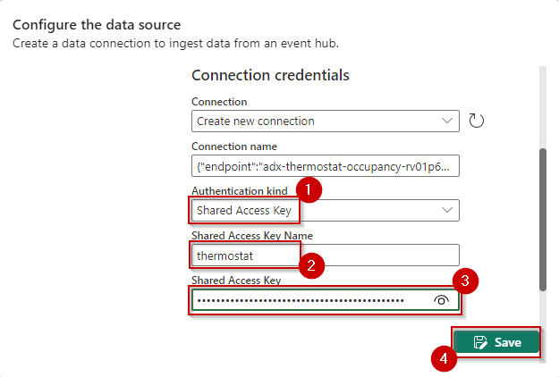

13. Click on the dropdown in the Consumer group field and select $Default.

	

`Note: Wait for the connection to be established.`

14. Click on the Next button..

	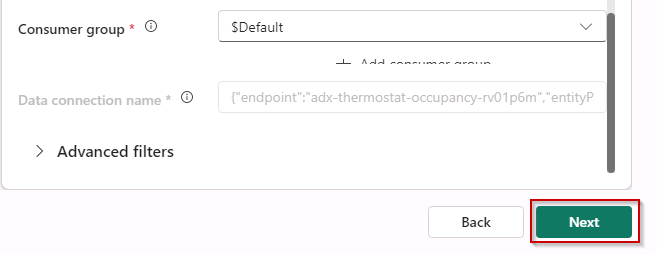


`Note: In the Inspect tab, data loading will take some time.`

15. In the Inspect tab, click on the dropdown button next to Format: TXT, select JSON and click on the Finish button.

	


16. **Wait** for the ingestion to complete, you will notice green checks that denote the completion. Finally, click on the **Close** button.

    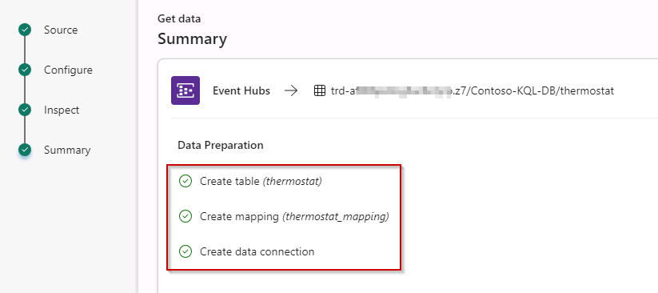

17. Hard refresh the page using **Ctrl + Shift + R** to see the details for the ingested data.

   
	
Real-time data from the event hub has been ingested successfully into the KQL Database.

### Task 6.3: Analyze/discover patterns, identify anomalies and outliers using Kusto Query Language

Kusto Query Language is a powerful tool. In this scenario KQL is used to explore Contoso’s data, discover patterns, identify anomalies and outliers, create statistical modeling, and more.

We use KQL to query the thermostat data that’s streaming in near real-time from the devices installed in Contoso’s stores.

1. Click on **Workspaces** and select **contosoSales**.

	

2. Click on **+ New** and select **KQL Queryset (Preview)**.

	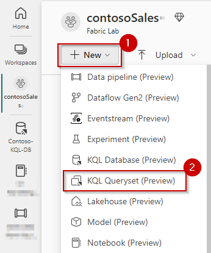

3. Copy paste the 'KQL Queryset Name' as **Query Thermostat Data in Near Real-time using KQL Script** and click on **Create** button.

```BASH
Query Thermostat Data in Near Real-time using KQL Script
```


4. **Wait** for the query set creation and a new screen will display. In this screen, click on **Contoso-KQL-DB**, verify the workspace name and then click on the **Select** button.

	

5. Select all using **Ctrl + A** and **delete** the pre-written query.

	

6. **Paste** the query provided below in the query section.

```BASH
//What is the average temperature every 1 min?
thermostat | where EnqueuedTimeUTC >= ago(1d) | where DeviceId == 'TH005' | summarize avg(Temp) by bin(EnqueuedTimeUTC,1m) | render timechart 

//What will be the temperature for next 15 Minutes?
thermostat | where EnqueuedTimeUTC > ago(1d) | make-series AvgTemp=avg(Temp) default=real(null) on EnqueuedTimeUTC from ago(1d) to now()+15m step 1m  | extend NoGapsTemp=series_fill_linear(AvgTemp) | project EnqueuedTimeUTC, NoGapsTemp | extend forecast = series_decompose_forecast(NoGapsTemp, 15) | render timechart with(title='Forecasting the next 15min by Time Series Decmposition')

//Are there any anomalies for this device?
thermostat | where EnqueuedTimeUTC > ago(1h) | where DeviceId == 'TH005'| make-series AvgTemp=avg(Temp) default=real(null) on EnqueuedTimeUTC from ago(1d) to now() step 1m | extend NoGapsTemp=series_fill_linear(AvgTemp) | project EnqueuedTimeUTC, NoGapsTemp | extend anomalies = series_decompose_anomalies(NoGapsTemp,1) | render anomalychart with(anomalycolumns=anomalies)

```

7. Select the query. **(Line 2)**

8.	Click **Run**.

The graph/result visualizes the data in a line chart. We see that it looks like the temperature is currently quite pleasant.

9. Select the query. **(Line 5)**

10. Click Run.

The graph/result visualizes the average temperature in the next 15 minutes, in anticipation of heavy foot traffic due to the ongoing sale.

11. Select the query. **(Line 8)**

12. Click Run.

The third query is executed to keep an eye on the temperature and detect any anomalies. A sudden rise or drop in temperature triggers an alert for the Contoso staff to check the situation and take necessary action to bring the temperature back to an optimal level.

### Task 6.4: Create a Real-time Power BI report using KQL DB/KQL Query

1. Click on **Build Power BI report**.

	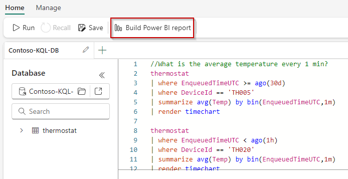

2. Hover over the **Power BI Report layout** and **navigation panel**.

3. See the table on the right side.

4. **Close** the Power BI report page.

	

5. In **Power BI service**, click on **Workspaces** and click on **contosoSales**. 

	

6. Click on **Upload** and select **Browse**.

	

7. Browse to the reports from your local system through the path **"C:\LabFiles\IgniteDreamLab2023\artifacts\reports"**, select the **Real-Time and Historical in-store analytics with KQLDB.pbix** report and click on the **Open** button.

	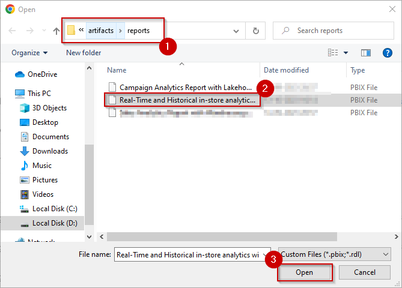

`Note: Wait for the report to upload.`

8. In the left navigation bar, select the **Contoso Sales** workspace.

	

9. Set the **Filter** to **Report** and click on the **Real-Time and Historical in-store analytics with KQLDB** report.

	

	

10. Hover over the **Average Temperature** to see the real-time data in Power BI.

	
